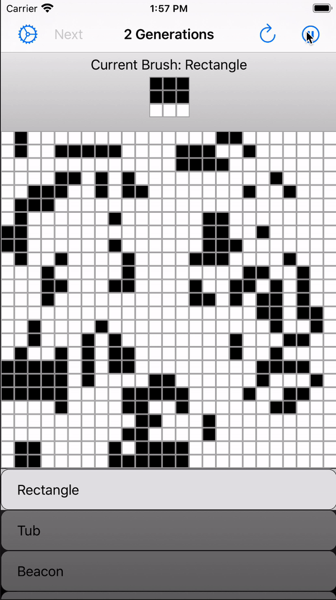
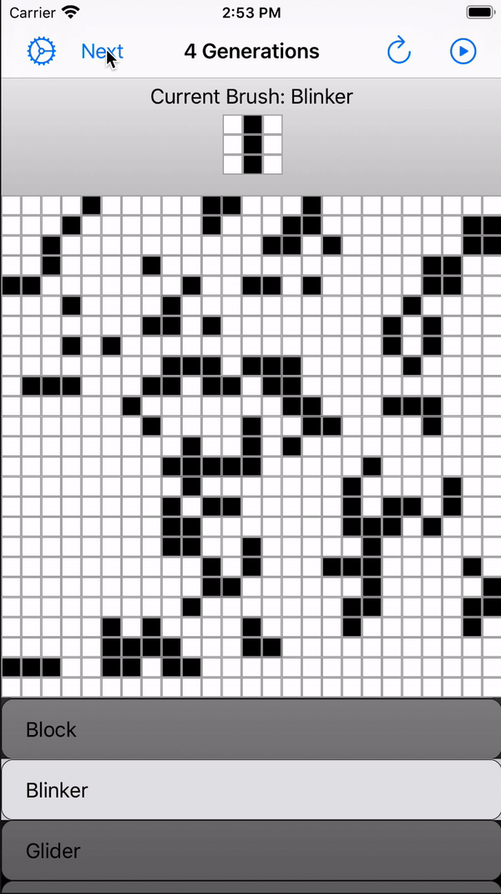

# Conways-Game-Of-Life
The **Game of life**, also known simple as **Life** is a cellular automaton devised by the British mathematician John Horton Conway in 1970. It is a zero-player game, meaning that its evolution is determined by its initial state, requiring no further input. One interacts with the game of life by creating an initial configuration and observing how it evolves.

---
# Rules
The universe of the Game of Life is an infinite, two-dimensional orthogonal grid of square cells, each of which is in one of two possible states, live or dead, (or populated and unpopulated, respectively). Every cell interacts with its eight neighbours, which are the cells that are horizontally, vertically, or diagonally adjacent. At each step in time, the following transitions occur:

1. Any live cell with fewer than two live neighbours dies, as if by underpopulation.
2. Any live cell with two or three live neighbours lives on to the next generation.
3. Any live cell with more than three live neighbours dies, as if by overpopulation.
4. Any dead cell with exactly three live neighbours becomes a live cell, as if by reproduction.

---
# Features
You can change the speed of the generations, go through generations one by one, as well as change the colors of the cells for a more vibrant and rich experience.

  

---

We'll take the **Life** in Game of Life to a whole new meaning. Experience the game in AR. Just point your camera at a flat surface and have fun!

